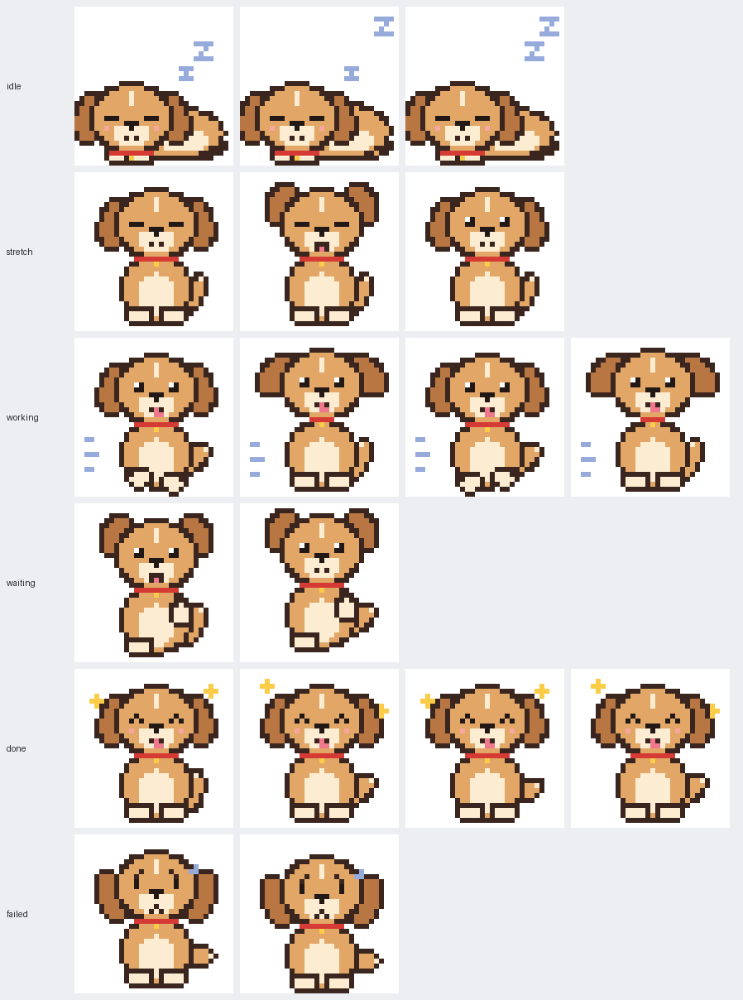

# Raicode Pet

A pixel-art desktop pet that floats on top of your windows and shows what Raicode is doing — working, waiting for you, done, or failed. Glance at it from any app; click it to jump back to the right terminal.



Native Swift (AppKit + SwiftUI), no third-party dependencies. macOS 14+.

## Install

Requires the Xcode Command Line Tools (`xcode-select --install`).

```bash
./build_app.sh
open /Applications/RaicodePet.app
```

The script builds a release binary, wraps it in an ad-hoc signed `RaicodePet.app` and installs it to `/Applications`. Use `./build_app.sh --no-install` to only build into `build/`.

Then, from the paw in the menu bar:

1. **Install Raicode Hooks** — adds the app's hook entries to `~/.claude/settings.json` (a backup is saved next to it; other settings stay untouched).
2. Allow notifications when macOS asks.
3. Restart any running Raicode sessions so they pick up the hooks.

> Keep the app in `/Applications`. The hooks point at the app's path at install time, so moving it breaks them — reinstall the hooks if you do.

## What the pet shows

| State | When | Notification |
|---|---|---|
| Idle | Session open, nothing running | — |
| Working | Prompt submitted or a tool is running | — |
| Waiting | Raicode needs permission or input | Always, with sound |
| Done | Task finished | Only for tasks of 5+ minutes |
| Failed | Task stopped with an error | — |

With several sessions, the most urgent state wins (waiting › failed › done › working › idle). Done and failed stay until you click the pet or start a new prompt. After 15 seconds of celebrating, the pet dozes off again while "Done!" stays up.

## Menu bar

- Show / hide the pet
- Live list of Raicode sessions — click one to focus its terminal
- **Pet** — pick Sunny (golden dog), Mochi (cat) or Bolt (robot)
- Notifications, sounds and launch at login toggles
- Install / remove Raicode hooks

### Custom pets

Pets in Codex Pets format are picked up from `~/.raicode-pet/pets` and `~/.codex/pets`. Use **Open Pets Folder…** and **Reload Pets** in the Pet menu.

## How it works

```
Raicode hook ─▶ RaicodePet hook (stdin JSON) ─▶ ~/.raicode-pet/sessions/<id>.json
                                                         │  file watcher
                                                         ▼
                                              SessionStore ─▶ pet window + menu bar
```

The same binary runs in two modes: `RaicodePet hook` is called by Raicode for each event, writes the session file and exits immediately (it never blocks Raicode). The app watches that folder and animates the pet.

| Path | What |
|---|---|
| `Sources/RaicodePetCore` | Pure logic: event mapping, session records, hook installer (unit-tested) |
| `Sources/RaicodePet` | App: window, pet rendering, menu bar, notifications |
| `tools/gen_sprites.py` | Generates `PixelSprites.swift` from the pixel art |
| `tools/make_icon.py` | Generates `Resources/AppIcon.icns` |
| `docs/superpowers/specs` | Original design doc |

## Development

```bash
swift test                                   # core logic tests
swift run RaicodePet render-frames /tmp/f    # dump every pet frame as PNG
```

Test a state by piping a fake hook event, then end the session so the pet doesn't stay stuck:

```bash
H=/Applications/RaicodePet.app/Contents/MacOS/RaicodePet
echo '{"hook_event_name":"PermissionRequest","session_id":"test","cwd":"'$PWD'"}' | $H hook
echo '{"hook_event_name":"SessionEnd","session_id":"test"}' | $H hook
```

## Troubleshooting

**Notifications show a blank app icon.** Notification Center caches an app's icon per bundle ID when it first grants permission, and doesn't refresh it — restarts don't help. If the app was first run without an icon, change `CFBundleIdentifier` in `build_app.sh` and rebuild. (This is why the bundle ID is `com.matthias.raicodepet`.)
